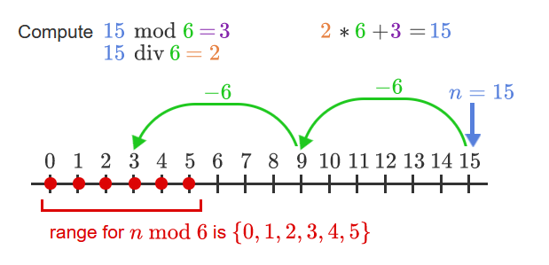

# Intro
- no late homework. you will be killed.
- two lowest labs, reading, and writing homework assignments get dropped at the end of semester.
- no formula sheets on exams.
- mandatory attendance (5% of grade).
- exams are 50% total of final grade.
- coding is the easiest part -- actually designing what you're coding is the hard part

# Scheme / DrRacket
- DrRacket seems to work like IDLE
- everything is either an atom or a list
## Atoms (primitive data types)
- integers
- real numbers (0.73, 3.17E+10)
- rationals (7/8, 11/3, -12/7)
- functions are done as such: `(+ 7/8 13/17)`
  - NOT like you want them to do it (`7/8 + 13/17`)
- symbols (x, y, x+y?, bad!)
  - names for data items and variables
  - you can actually use special symbols now
  - e.g.:
    ```scheme
    > (define x+y? 7)
    > x+y?
    7
    > x+y-
    x+y-: undefined;
    cannot reference an identifier before its definition
    > (define x+y- 8)
    > x+y-
    8
    ```
- booleans (#t, #f)
- strings ("alligator", "hello world!")
- characters (#\a, #\b)

## Built-in Operators
- +, -, *, / , abs, max, min
- usually work for >=2 operands
    ```scheme 
    > (+ 1 2 3 4 5 6 7 8 9 10)
    55
    > (* 1 2 3 4 5 6 7 8 9 10)
    3628800
    ```
- relational operators: `<` `>` `<=` `>=`
    ```scheme
    > (< 8 7)
    #f
    ```
    ```scheme
    > (= 8 (* 4 2))
    #t
    ```
- relational operators for more complex data types: `eq?` `eqv?` `equal?`
- logical operators `and` `or`  `not`
    ```scheme
    > (and (= 7 7) (< 8 7))
    #f
    > (or(= 7 7) (< 8 7))
    #t
    ```
## Built-in Predicates
- a function that returns a boolean value
- `number?` `integer?` `pair?` `boolean?` `string?`
    ```scheme
    > (number? 7)
    #t
    > (number? 7/12)
    #t
    > 
    > (number? "hi")
    #f
    ```

## Applying Functions
- `(function arg1 arg2 arg3 ... argN)`

## The List Data Type
- a sequence of objects within parentheses
- the interpreter always expects the first item to be a function
    ```scheme
    > (1 2 3 4)
    application: not a procedure;
    expected a procedure that can be applied to arguments
    given: 1
    > `(1 2 3)
    (1 2 3)
    > (quote (1 2 3))
    (1 2 3)
    > (define x (1 2 3))
    application: not a procedure;
    expected a procedure that can be applied to arguments
    given: 1
    > (define x `(1 2 3))
    > x
    (1 2 3)
    ```
- `cons` returns a given list with something prepended to it
- `car` returns the first item in the list
- `cdr` returns everything except he first item in it
- `length`
- `pair?` returns true if the list *is not* empty
- `null?` returns true if the list *is* empty

## Rules for Expression Evaluation
- numbers, strings, literals, all evaluate to themselves
- symbols are interpreted as variables, so they interpret to the value they represent
- lists:
    1. make sure the first element is a function (otherwise throws error)
    2. apply the function to everything in the list
    3. return the result
- a list of data interprets as itself
  - remember to use (quote 1 2 3) or `(1 2 3)

## Defining new functions
`(define (function-name param1 param2 ...) expr)`
we will implement
- arithmetic average `(x+y)/2`
- geometric average `sqrt(x*y)`
- harmonic average `2/((1/x)+(1/y))`
```scheme
(define (a-avg x y) (* 1/2 (+ x y)))
(define (g-avg x y) (sqrt (* x y)))
(define (h-avg x y) (/ 2 (+ (/ 1 x) (/ 1 y))))
```
```scheme
> (a-avg 20 30)
25
> (g-avg 20 30)
24.49489742783178
> (h-avg 20 30)
24
```

## Equality operators
```scheme
(= n m) ; checks whether n and m are equal in value
(eq? n m) ; identity operator - checks if n and m point to the same place in memory
          ; works for literals
(eqv? n m) ; checks if n and m are numbers --
           ; if so it returns (= n m), otherwise returns (eq? n m)
(equal? n m) ; checks if n and m form structures with the same components -- 
             ; i.e. are lists whose corresponding elements are equal.
```
```scheme
> (define x 2)
> (define y 2)
> (eq? x y)
#t
```
you can do this because 2 is stored in the same memory location no matter what variable is pointing to it

```scheme
> (define x `(2 3))
> x
(2 3)
> (define y `(2 3))
> y
(2 3)
> (eq? x y)
#f
> (equal? x y)
#t
```
the lists point to different memory locations, but their elements are equal.

## Conditionals
```scheme
(if (condition) 
  "runs if true" 
  "runs if false"
)
(cond 
  [(condition1) "1 true"] 
  [(condition2) "2 true"] 
  [else "runs for else"]
)
```
the basics:
```scheme
> (if (< 1 2) "less" "more")
"less"
> (if (< 3 2) "less" "more")
"more"
> (define x 6)
> (cond [(eq? x 1) "its 1"] [(eq? x 2) "its 2"] [else "something else"])
"something else"
> (define x 1)
> (cond [(eq? x 1) "its 1"] [(eq? x 2) "its 2"] [else "something else"])
"its 1"
> (define x 2)
> (cond [(eq? x 1) "its 1"] [(eq? x 2) "its 2"] [else "something else"])
"its 2"
```


let's try to implement a function like python's `filter()` recursively:
```scheme
(define (apply-pred list pred)
  (cond 
    [(null? list)
      `()]
    [(pred (car list))
      (cons (car list) (apply-pred (cdr list) pred))]
    [else
      (apply-pred (cdr list) pred)]))
```
- we're using `cond` because there are 3 possible branches -- the list is empty, the current item is caught by the filter, and the current item is not caught by the filter.

# Logic
- Logic is a study of arguments
- Arguments are a sequence of statements whose purpose is to establish the truth of an assertion.
- those statements are *premises*, except for the last one which is a *conclusion*
- a proposition will be true or false always
  - "It is raining" is a valid proposition
  - "What time is it?" is not a T/F statement therefore it's not a proposition
- two boolean formulas are considered equivalent if they have the same formulas
  - implies that their truth tables are the same

# Compound Propositions
- The conjunction symbol ∧ is AND.


- The disjunction symbol ∨ is inclusive OR.


- XOR looks the same ⊕.
  - XOR and OR are nearly the same except T XOR T = F whereas T OR T = T.
- negation symbol NOT ¬ toggles its input.


- when filling in a logic table
  - amount of rows = 2^(amt of variables)
  - just variable rows:
  - rightmost row alternates TFTF...
  - then TTFF
  - then TTTTFFFF
  - etc. (keep doubling the amount of T/F)
  - i think of it as binary counting but who cares

- given p implies q (p -> q), the only way it can return false is if p is T and q is F.

  - p is the hypothesis, q is the conclusion
  - in this way, a conditional statement will always return true if the hypothesis p is false
    - if you don't mow the lawn, Mr. Smith can pay you or not and it doesn't matter. this always returns T.
    - if you mow the lawn and he pays you then the contract is fulfilled and it returns T.
    - if you *do* mow the lawn and he *doesn't* pay you, the contract is broken and the statement returns false.
    - i.e. True -> False is the only way to make it return F.

here's a table for the converse, contrapositive, and inverse of a conditional statement.


- biconditional statements like p ↔ q require both to be the same to return T.
  - if p and q return T. if not p and not q then return T. else return F.


- apparently you can use p ⇔ q to denote that p = q (and therefore p ↔ q = T) but i don't think the book ever does


for valid propositions p and q, these are valid propositions
- ¬p (~p)
  - not p
- p ∨ q
  - p or q
  - disjunction
- p ∧ q
  - p and q
  - conjunction
- p → q (p => q)
  - p then q
  - implication / conditional
  - p = hypothesis, q = consequence
  - uncommon versions:
    - p only if q = p → q
    - p unless q = ¬q → p = p ∨ q
  - p → q = ¬q ∨ p
- p ↔ q (p ⇔ q)
  - p iff q
  - biconditional / equivalence
- order of operations:
1. fill in actual truth values
2. any quantified statements
3. innermost parentheses
4. not ¬
5. and ∧, or ∨
6. conditionals ⇒, biconditionals ⇔

## Logical Equivalences
- a tautology is always correct, regardless of the input
  - p ∨ ¬p = T no matter the value of p
  - p ∧ q -> p = T
- a contradiction is always false, regardless of the input
  - p ∧ ¬p = F no matter the value of p
- apparently logical equivalence is supposed to be ≡ but i'm using =. i don't have ≡ on my keyboard.
  - two things are logically equivalent if, for every possible combination of inputs, output the same values
  - you can prove this by making a logic table and putting the things you want to prove equivalent next to each other


- for some laws, multiplication = AND and addition = OR
- p implies q ≡ (not p) or q
- not(p implies q) ≡ p and (not q)
- the contrapositive of a statement is always equivalent to its original statement
  - (p → q) is logically equivalent to (not q → not p)
- ¬(p → q) ≡ p ∧ ¬q
- a *recognizer expression* is only true for one single input
  - we are doing minterm expansion i am not taking these notes again
- CNF - conjunctive normal form
  - a lot of disjunctions connected by ands
- DNF - disjunctive normal form
  - minterm expansion form
  - a lot of conjunctions connected by ors


## symbol key
- ∈ = belongs to / is an element of
- ℤ = set of integers
  - ℤ⁺ = all positive integers (excl. 0)
- ℝ = set of all real numbers
- ℚ = set of all rational integers
  - recall scheme handles fractions well
- ℕ = set of all natural numbers = **Z**⁺ ∪ `{0}`
- ∀ = for all -- universal quantifier
- ∃ = there exists -- existential quantifier
- not ¬
- and ∧
- or ∨
- xor ⊕
- logically equivalent to ≡
- implies →
- iff ↔ biconditional arrow
- requires ⇔ iff double arrow

# Quantified Statements
- recall a predicate is a statement that only returns true or false
- a predicate function contains a finite number of variables and indicates whether a relationship is held by the objects represented by those variables.
  - when you fill in the variables with objects it becomes a proposition
  - a predicate has a variable and a domain and as such has no inherent truth value vs.
  - a proposition does not contain any variables and as such has a set truth value
- the domain is the set of all variables for which it is defined, i.e. all that make sense
- ex
  - Let D = {1,2,3,4,5} and consider ∀x (x² ≥ x)
  - Is this statement true?
  - prove for every element of the domain; yes.
- Existential Quantifier ex.
  - Let P(x) = x² - 4 > x be a predicate with a domain consisting of all real numbers
  - ∃x P(x) (there exists an x for P(x) that makes P(x) true)
  - True! (10, per se)
- ∀x<0 (x² > 0)
  - for all x that are <0, are any x² > 0?
  - also ∀x(x < 0 → x² > 0)
- the input that makes a predicate false is the ***counterexample***
- proving or disproving universally/existentially quantified statements
  
- usually you have to prove a ∃ statement true, vs proving a ∀ statement false 
- the quantifiers have higher precedence than all other operators
- the variable x in P(x) is a *free variable*
  - you cannot do any calculus with this because we don't know what to do with x
- in ∀xP(x), x is now a *bound variable* bc it is bound to the quantifier
  - now we can evaluate it
- you cannot do (∀xP(x)) ∨ Q(x) because now x is both bound and free (illegal)
  - though you can do ∀x(P(x) ∨ Q(x)), because here ∀x binds both occurrences of x
- DeMorgan's law for quantified statements:
  - ¬(∀y Q(y)) = ∃y ¬Q(y)
  - ¬(∃z R(z)) = ∀z ¬R(z)
- quantifiers are sorta distributive [like here](https://math.stackexchange.com/a/3059525)
  
## Lab examples
- Given P(x) with domain 1, 2, 3, 4, 5:
  - ∃xP(x) ≡ P(1) ∨ P(2) ∨ P(3) ∨ P(4) ∨ P(5)
  - ∀xP(x) ≡ P(1) ∧ P(2) ∧ P(3) ∧ P(4) ∧ P(5)
  - ¬∃xP(x) ≡ ¬(P(1) ∨ P(2) ∨ P(3) ∨ P(4) ∨ P(5)) 
    - ≡ ¬P(1) ∧ ¬P(2) ∧ ¬P(3) ∧ ¬P(4) ∧ ¬P(5) ≡ ∀xP(x)
- given P(x) = ∀x(x² > x)
  - ¬P(x) ≡ ∃x(x² ≤ x>)
  - when negating a inequality operator, it toggles the direction *and* its "or equal to"

## Nested Quantifiers
- Consider:
- M(x,y): x sent an email to y.
  - ∀x∀yM(x,y) ≡ everyone sent an email to everyone (including themselves)
  - ∃x∃yM(x,y) ≡ someone sent an email to someone (possibly themselves)
  - ∃x∀yM(x,y) ≡ someone sent an email to everyone (including themselves)
  - ∀x∃yM(x,y) ≡ everyone sent an email to someone (possibly themselves)
- the existential quantifier is trying to make the statement true
  - only needs one to be true
- the universal quantifier is trying to make it false
- DeMorgan's law still works, it just swaps all of the nested quantifiers

  - you can do it to one quantifier at a time if necessary, but you will probably always do the whole thing
- what if we want to say everyone sent an email to everyone else, but not themselves?
  - ∀x∀y((x≠y) ∧ M(x,y)) ≡ everyone sent an email to everyone *except themselves*
- consider L(x): x was late to the meeting
  - we want to say that only one person was late to the meeting
  - ∃x(L(x) ∧ ∀y((x≠y) → ¬L(y)))
- ∀x,yP(x,y) ≡ ∀x∀yP(x,y)

# Inference Rules
- an argument form is a sequence of formulas (preceding premises) the last of which is called the conclusion
  - premises are also called hypotheses
- argument form is valid if, when all of the premises are true, the conclusion is also true.
- p1, p2, ..., pn, ∴q is a valid argument iff p1 ∧ p2 ∧ ... ∧ pn → q is true
- syllogisms have two premises and a conclusion
- Modus Ponens:
  - p → q
  - p
  - ∴q
    - ≡ (p → q) ∧ p → q ≡ T
- Modus Tollens
  - p → q
  - ¬q
  - ∴¬p
- you can change order of premises
- you can replace or add a proposition equivalent to any premise
- when using a truth table
  - prove the conclusion true by finding all rows where all hypotheses are true AND the conclusion is true.
  - if there are any rows with a truth mismatch between any hypotheses and the conclusion than the argument is false.
- usually when they ask to prove that an argument is invalid, they want to to prove that there is some case where all of the hypotheses are true but the conclusion is false. 


# Set Theory
- A set is a well-defined collection of objects
- set builder notation: `{x ∈ ℤ+ | x <= 4}`
  - the set of all x in the se tof positive integers where x is less than or equal to 4
- set roster notation: `{1, 2, 3, 4}`
- a set whose elements can be explicitly listed is a finite set
  - i.e. the set of prime numbers
  - cardinality = |set| = amount of unique values
  - any others are infinite sets
    - cardinality of infinity
- order is irrelevant; membership is important
  - `{1, 2, 3}` = `{3, 1, 2}`
- `{0} != 0`
  - a set and object are two different things
  - a set contains objects
- a subset contains any amount of elements from another set and none that are not in that other set
  - a PROPER subset contains any amount of elements from another set but NOT all of them and none that are not in the other set.
  - if a set is a proper subset of another set, then it is also a regular subset of it too. not  vice versa.
- the power set of A, P(A), is the set of all subsets of A
  - A = `{1, 2, 3}`
  - P(A) = `{∅, {1}, {2}, {3}, {1, 2}, {1,3} {2,3}, {1,2,3}}`
  - a set's power set has 2^(|set|) elements
- the intersection of two sets is the set of all elements they have in common
- the union of two sets is the set of the contents of both sets
- set difference: A - B or A \ B = `{x ∈ U | x ∈ A and x ∉ B}`
  - A \ B = A ∩ B̄ 

# Cartesian Products
- punnet squares


- may denote a product with a set's self as a power
  - A = `{x,y}`
  - A^2 = A×A = `{(x,x), (x,y), (y,x), (y,y)}` 
    - as a set of strings: `{xx, xy, yx, yy}`
  - etc.
  - unlike in finding subsets, self-products can double up the same value.
    - `{(x,x)}` is not a subset of A but it is a subset of A^2

# Strings
- you can have sets of symbols or characters
- putting the letters together without the set notation gives you a string
  - A = `{h, i}`, string = `hi`
- the set of all characters in a set of strings is called its alphabet
- they also have a length (1-indexed)
- concatenate strings by putting the name of their sets together
  - t = abc, s = def
  - ts = abcdef
- can also concatenate one symbol the same way
  - t = 001
  - t0 = 0010
- the empty string is λ
  - tλ = t

## Binary Strings
- a binary string contains only 1s and 0s
- one bit = one character in a binary string
- all binary strings of length n = `{0,1}ⁿ`
  - `{0,1}²` = `{00, 01, 10, 11}`

# Functions
- think of them here like a map
  - mapping X onto Y: f: X → Y
    - X = *domain*, Y = *target*
  - or a subset of X × Y, where (x, y) ∈ f iff f maps x to y.
    - in this case X and Y can be the same set
- you can list all pairs of (x, y), i.e. (x, f(x)) if both X and Y are finite sets
- you can do arrow diagrams
- y is in the **range** of f iff there is an x ∈ X such that (x,y) ∈ f.
  - i.e., all elements in Y that can be produced by some f(x)
  - range is also called 
- when you have infinite domain you can't have a diagram for it
  - draw a graph instead
- a **well-defined function** has exactly one f(x) for each x
  - anything with a ± is not well defined
  - usually not considered a function if any x has >1 f(x)
- two functions f and g are equal (f = g) iff they have the same domain and f(x) = g(x) for all x in domain
- **one-to-one / injective function**: ∀(x1, x2) ∈ A: (x1 ≠ x2) → f(x1) ≠ f(x2)
  - |X| ≤ |Y| → there us an injective mapping from X to Y
- **onto / surjective function**: ∀y ∈ B ∃x ∈ A: f(x) = y
  - i.e. every element in y has an f(x) that produces it
  - or there are no elements in y that can not be produced by taking an f(x)
  - |X| ≥ |Y| → there is a surjective mapping from X to Y
- **one-to-one correspondence / bijective**: iff the function is both subjective and surjective
  - |X| = |Y| → there is a one-to-one mapping of X onto Y
  - there are no bijections from **Z** to **R** or vice versa
- if a function is strictly increasing ro strictly decreasing it is automatically one-to-one, e.g.
  - f(n) = n-1
  - f(n) = n³
  - i.e. the derivative is always either >0 or <0

## Floor & Ceiling Functions
- floor: round down
  - **R** → **Z**, where floor(x) = the largest integer Y such that y ≤ x.
  - floor(x) = ⌊x⌋
- ceiling: round up
  - **R** → **Z**, where floor(x) = the smallest integer Y such that y ≥ x.
  - ceiling(x) = ⌈x⌉

# countability of sets
- set S is finite if it has a cardinality equal to `|{1, 2, ..., n}|` for n ∈ **N**
- a set S is countable if it has the same cardinality of some subset of **Z**⁺
- a set S is countably infinite if there is a one-to-one function f: S → **Z**⁺ (which is also f: **Z**⁺ → S)
- uncountably infinite → greater cardinality than **Z**+
- countably infinite sets have lower cardinality than uncountably infinite sets
  - we know |**Z**⁺| < |P(**Z**⁺)| 
    - as a rule |P(S)| > |S|
  - for every possible list of sets including/excluding elements of **Z**⁺ there is a variation that you haven't listed yet
- **N** is not just **Z**⁺, it's actually **Z**⁺ ∪ `{0}`
- can we prove that **N** and **Z**⁺ have the same cardinality? 
  - find a one-to-one function that maps all of **N** onto **Z**⁺
  - f: **N** → **Z**⁺
  - f(n) = n+1
  - this function is strictly increasing and both sets are infinite therefore this is one-to-one
- all of the rooms in the uncountably infinite hotel are occupied; however we can accommodate one new guest by putting him in the first room and making everyone move down one
  - the rooms are uncountably infinite → there is actually another room even though we said they're all full
  - for all current guests map **Z**⁺ → **Z**⁺ by current room number n ∈ **Z**⁺ and new room no. f(n) ∈ **Z**⁺ where f(n) = n+1
  - now the first room is still here but empty for the new guest

# Midterm Review
- compressing an interval:
  - multiply it by some fraction 0 < m < 1 and add some similar fraction
  - e.g. [0,1] -> (0,1)
    - some compression function f(x) = x/3 + 1/2
  - schroder-bernstein theorem tells us that, because we can do this compression, then [0,1] has the same cardinality as (0,1)
- if X and Y is countable, then X ∪ Y is countable
- no union of countable sets will equal an uncountable set
- power set of an uncountable set will *always* have a greater cardinality than the original set

# Relations
- a relation R of A to B is any subset A × B
- A is the domain
- B is the co-domain
- instead of (x,y) ∈ R, we write x R y.
- you can draw arrow diagrams or tables to show all possible pairs

## Types of Relations
- a relation R on a set A is **reflexive** if (a,a) ∈ R for all a ∈ A.
  - i.e. it includes all possible self-loops
  - e.g. a reflexive relation of `{1,2}` would look like `{(1,1), (2,2)}`
  - it could also include other pairs like `{(1,1), (1,2), (2,1), (2,2)}`
  - represented as a matrix, its diagonal will be all 1s
    - place a 1 in coords where the pair exists in the relation and 0 in the rest
- an **irreflexive** relation has no pair aRa for any a ∈ R.
- a relation R on a set A is **symmetric** if (a,b) ∈ R ⇔ (b,a) ∈ R for all a,b ∈ A
  - i.e. for all pairs (a,b) in the set there will be another pair (b,a)
  - the matrix will reflect over the diagonal
  - 
- an **anti-symmetric** relation is one where: for a,b ∈ R, if there is aRb and bRa then a = b
  - i.e. if there is aRb, the must be **no** bRa.
  - offers no info about aRa; R could be reflexive or irreflexive
- an **asymmetric** relation is both antisymmetric and irreflexive
  - ∀a,b ∈ A: aRb ⇒ ¬(bRa)
  - there are no pairs aRa and, for all pairs xRy there is no yRx.
- a relation R on a set A is **transitive** if [for all a,b,c ∈ A] (a,b) ∈ R and (b,c) ∈ R then (a,c) ∈ R.
  - the pairs (a,b) and (b,c) require the existence of (a,c). if no (a,c) then R is not transitive.
  - 
  - a relation is either transitive or not, there is no neither option.

### Equivalence Relations
- a relation R on a set A is an **equivalence** relation if it is reflexive, symmetric, and transitive
  - e.g.:
  - 
- If A is the domain of an equivalence relation and a ∈ A, then [a] is defined to be the set of all x ∈ A such that a~x. The set is called an **equivalence class**.
  - i.e. `{x ∈ A | (x,a) ∈ R}`
  - i.e. all the elements than a can be paired with a to make the largest possible equivalence relation
  - when R is an equivalence relation, we will write a~b instead of aRb.
  - equivalent sets are either equal or disjoint. for y,z ∈ equivalence relation R,
    - if y~z then [y] = [z]
    - if y is not ~ z, then [y] ∩ [z] = ∅
  - let A be the set of all people in a friend group. let R be a relation over A where aRb iff a,b ∈ A and a and b know each other. this is an equivalence relation so we can write this as a~b. for z ∈ A, [z] will be the set of everyone in the group who knows z.
  - in an equivalence relation, every element is in some equivalence class because all equivalence relations are reflexive.
- partitions are isolated sections of an equivalence relation.


# Induction
principle of mathematical induction:
```
P(b)
∀k≥b P(k) → P(k+1)
∴ ∀n≥b P(n)
```
- think of it like infinite modus ponens in a row
  - you just have to prove the first one and that each one implies the next.
  - i.e., for all k, P(k) holds and P(k) implies P(k+1)
- the *inductive hypothesis* is the supposition that P(k) holds
- inductive proof: for example we are trying to prove P(n) holds for all n ∈ **Z⁺**.
  - prove the basis
    - we prove that P(1) holds. we use 1 because it is the least element of **Z⁺**.
  - inductive step
    - prove that for k≥1, P(k) ⇒ P(k+1)
    - when it's not obvious, the first step is undoing one operation to turn k+1 into k and proving that this holds
  - proof of inductive step
    - prove that k+1 holds.
  - now we know P(k+1) is true
  - by the principle of induction the theorem holds for all n ∈ **Z⁺**.
- [this](https://www.youtube.com/watch?v=LwqrOpoK9FE) is how you wanna do it

## Strong induction
```
P(6)
P(6) → P(7)
P(6) ∧ P(7) → P(8)
P(6) ∧ P(7) ∧ P(8) → P(9)
P(6) ∧ P(7) ∧ P(8) ∧ P(9) → P(10)
...
⋀(6≤i≤k) P(i) → P(k+1)
...
∴ ∀(n≥6) P(n)
```
```
P(b)
∀(k≥b)( ⋀(b≤i≤k) P(i) → P(k+1) )
∴ ∀(n≥b) P(n)
```
strategy:
- prove the basis P(1)
  - can be different numbers depending on what you're proving
- inductive step: 
  - assume that for all k≥1, the statement holds for all P(1), P(2), P(3), ..., P(k)
  - then prove P(k+1)
- assuming the inductive hypothesis is true, we can also assume P(k-1) is also true
this relies on the well-ordering principle - that every non-empty set of non-negative integers has a smallest element.

## Induction for a recursive formula
[from this video](https://www.youtube.com/watch?v=iqpeZXAqFrw). shoutout this guy for teaching like he wants his students to actually learn.
- take for example Tₙ = Tₙ₋₁ + 2n where T₁ = 2. we want to prove that (1) Tₙ = n²+n
- We'll test that (1) is true
  - we can use the recursive formula for T₂ = T₁ + 2(2) = 6
  - we can also use (1) to show T₂ = 2²+2 = 6
  - therefore both ways fo finding T₂ are equivalent
- we'll assume for all k>1 (since T₁ is spoken for) that Tₖ = k²+k
- now we'll prove that Tₖ₊₁ = (k+1)² + k + 1
  - = k² + 2k + 1 + k + 1 = k² + 3k + 2
  - so we'll prove Tₖ₊₁ = k² + 3k + 2 bc it's the same thing
  - from recursive formula: Tₖ₊₁ = Tₖ₊₁₋₁ + 2(k+1)
  - = k² + k + 2k + 2 by assumption
  - = k² + 3k + 2 = Tₖ₊₁, QED

# Axioms for natural numbers
natural numbers are the minimal set which follow these properties
- there is a 0 which is a member of N
- there is a map S: N → N which associates every n ∈ N with n's successor
  - S(0) = 1, S(1) = 2, S(2) = 3, S(3) = 4...
  - we can define a predecessor function, addition, and multiplication with similar functions
- ∀(n ∈ N) 0≠S(n)
- ∀(m,n ∈ N) m ≠ n ⇒ S(m) ≠ S(n)
- induction axiom where ϕ is some boolean function
- all sets that have this are indistinguishable from each other since there is only one set that does this

# Division Algorithm
- x divides y iff x≠0 and y= some integer k times x
  - i.e. y/x = is a positive integer
  - if true, y is a **multiple** of x and x is a **divisor**/**factor** of y
  - also denoted as x∣y.
    - if x does not divide y then x∤y
- a **linear combination** of 2 numbers is the sum of multiple of those numbers
  - x|y and x|z ⇒ x|(sy+tz) for any integers s and t
- division algorithm:
  - for integer n and positive integer d, there are some q and r (0≤r≤d-1) such that n = qd + r
    - q is the quotient
      - n div d, n//d -- integer division
    - r is the remainder
      - n mod d
      - this is the % operator but worse
  - when negative, the quotient overshoots into the negatives and the remainder will be positive
    - e.g. -7 div 4 = -2; -7 mod 4 = 1. -2(4) + 1 = -7
  - 
  - 

# Modular Arithmetic
- x mod m of an integer m>1 will always result in an element from the set `{0,1,2,...,m-1}`
- taking for example `{0, 1, 2, 3, 4}`, we can do addition on it then apply x mod 5 to it and always have an answer in that set
  - like a circular counting system
- doing addition and applying a mod operation is **addition mod m**
- multiplying and applying mod is **multiplication mod m**
- the set `{0,1,2,...,m-1}` with addition and multiplication mod m is called the **ring** 
  - we can denote the ring **Z**ₘ.
- precedence: mod happens before addition but after multiplication
  - 6+2mod7 = 6 + (2 mod 7) = 8
  - 6\*2mod7 = (6*2) mod 7 = 5
  - not necessarily the case in programming
- we can use mod to simplify mod calculations.
  - (x+y) mod m = ((x mod m) + (y mod m)) mod m
  - (xy) mod m = ((x mod m)(y mod m)) mod m
  - (xʸ) mod m = (x mod m)ʸ mod m
## Congruence mod m
- let x, y, m be integers and m>1. x is congruent to y mod m iff `x mod m` = `y mod m`.
- x and y are not necessarily equal, but they are the same distance away from the closest multiple of m.
- this can be denoted as x ≡ y(mod m)
- x ≡ y(mod m) ⇔ m∣(x-y)
- it's probably easier to check that (x-y)/m is an integer than any of that mod shit

# Prime factorizations
- **prime factorization**: every integer > 1 can be expressed as a product of primes 
- the fact that every number only has one prime factorization is the **fundamental theorem of arithmetic**
  - only true if we're only counting non-decreasing prime factorizations, since you can list the multiplication in any order otherwise.
  - we are ignoring 1 as a factor entirely
- a **non-decreasing sequence** is pretty self-explanatory.
  - each number must be ≥ its predecessor
  - e.g. 1, 1, 2, 3
- **multiplicity**: how many times a given number appears in the prime factorization of some number.
  - for ease we will write PF's with exponents, so the multiplicity will be that number's power.
  - e.g. 612 = 2² \* 3² \* 17
    - 2's multiplicity is 2; 3's is 2; 17's is 1
- greatest common divisor and least common multiple are back
  - gcd of some x and 0 = |x| because every number is a factor of 0.
  - absolute value to cover for when x is negative because |x| ≥ x
  - gcd of 0 and 0 is undefined because it can be any integer.
- **relative primes** have GCD = 1
  - their prime factorizations have no factors in common
- 
- GCM is the same except we take the min

# Factoring and primality
- it is difficult to test whether comically large numbers are prime because there are too many possible factors to run though
- brute force primality testing:
  - check whether x divides N for every 1 < x ≤ N-1
- we can improve this by only testing up to floor(sqrt(N))
  - check whether x divides N for every 1 < x ≤ floor(sqrt(N))
  - this still requires checking floor(sqrt(N)) numbers though, which gives it O(sqrt(N)), which is still not very good
- the prime number theorem
  - π(x) is the amount of primes between 2 and x, both inclusive.
  - limit(x→∞) π(x)/(x/ln(x)) = 1
  - 
  - explains how dense prime numbers are among the integers
  - gives the density of primes in the set of integers up to and including x
  - if a random number is selected from the range 2 through x, then the likelihood that the selected number is prime is roughly 1/ln(x)
- we can find a prime digit with n digits more quickly.
  - chose a random number with n digits.
  - check if it is prime.
  - if yes break, else restart.
  - using the prime number theorem, we know the likelihood of each choice being prime is 1/lnx.
  - the amount of trials is proportional to n, the amount of digits, which is much better than 10ⁿ, the value of the number we end up with.

# Loop invariants / program correctness
- this sin't in the class yet i did the wrong zybooks
- program verification proves that programs do what they're supposed to do
  - we are verifying that when the precondition is a certain way the post-condition should also be a certain way
- we can break a program down into smaller pieces
  - like one per command
  - and check the precondition and post-condition for each of them
- the *loop condition* is the conditional statement letting a while loop run
  - we can also call it the ***loop invariant***
  - because, as long as the program is running that loop, that statement will be true
- steps of proving all parts of a loop invariant: 


# GCD and Euclid's Theorem
- GCD Theorem: for positive integers x, y, gcd(x,y) = gcd(y mod x, x)
- Euclid's algorithm:

- Extended Euclidean Theorem: gcd(x,y) = sx + ty
  - i.e. gcd(x,y) will be a linear combination of x and y
- The multiplicative inverse mod n, which we might call inverse mod n, is some integer s such that sx mod n = 1
  - not every mod has this
  - if a is a multiplicative inverse of x, then x is a multiplicative inverse of a
  - e.g. 3 is an inverse of 7 mod 10 because (3\*7) mod 10 = 1
  - e.g. (7\*5) mod 17 = 1 therefore 7 is an inverse of 5 mod 17 and 7 is an inverse of 5 mod 17
- a number's coefficient in eEuclid's extended algorithm is its multiplicative inverse mod the other number.
  - e.g. for sx + ty, 
    - s is an inverse of x mod y
    - t is an inverse of y mod x
## Extended Euclidean Algorithm
 

# Fast exponentiation
- finding powers by repeated multiplication is slow
- we can take a shortcut by repeated squaring
- 
  - note that e.g. 7⁸ breaks down into ((7^2)^2)^2
- try for example 4¹⁴ mod 6

- or:
```
find 3^7 mod 6
7 = (111)2S ==> 7 = 2^2 + 2^1 + 2^0
3^7 = 3^2^2 * 3^2^1 * 3^2^0
3^7 mod 6 = 3^2^2 mod 6 * 3^2^1 mod 6 * 3^2^0 mod 6
= 3^4 mod 6 * 3^2 mod 6 * 3 mod 6
= 3*3*3 mod 6 = 3^3 mod 6 = 3 mod 6 = 3
```

# Introduction to cryptography
- plaintext - unencrypted message
- ciphertext - encrypted message
- for secret key k, some integer N, converted plaintext m, and ciphertext c:
  - we can make a simple encryption algorithm c = (m+k) mod N
  - and decrypt it with m = (c-k) mod N
  - this isn't great but it's definitely a cipher
- no two distinct plaintexts can share the same ciphertext
- the decryption scheme must be the inverse of the encryption scheme
## lab 12
- ϕ(n) = the amount of numbers less than n with which n is relatively coprime
- for n = the product of prime numbers p and q, ϕ(n) = ϕ(pq) = (p-1)(q-1) (lab) 
## RSA Cryptosystem
- (ciphertext c) = (plaintext m)ᵉ mod N
- m = cᵈ mod N
  - where d is a private key only Bob has

- given public key (e, N)
  - N is the RSA modulus
    - its only nontrivial factors are p and q
    - N must be > ciphertext c
  - e is some prime 2 < e < N where e and Φ are coprime (gcd(e,Φ) = 1)
    - Φ is actually Φ(N) = (p-1)(q-1)
- to find private key d
  - d = multiplicative inverse of e mod Φ
    - ⇒ ed mod Φ = 1

# Graphs
- graph G = (V, E)
  - v is any set of objects
  - e is any set of pairs of objects in V
    - we interpret this as an edge that connects them
- the set of edges is a subset of the power set of V
- a regular graph has vertices that all have the same degree
- total degree of a graph is the sum of the degrees of all its vertices
- two vertices are connected if there is some path from one to the other
- a connected component is the largest possible set of connected vertices
  - a set can have multiple discontinuous components
- a graph is connected if there is an edge between all of its vertices
  - otherwise it is disconnected
## Directed Graphs
- when the domain and co-domain are the same you can make a directed graph (digraph)
  - a directed graph G is a pair (V,E) where V is a set of vertices and E is a set of ordered pairs (u,v) ∈ V×V called the directed edges.
- like an arrow diagram but it's just one set of points
- pairs like (1,1) will show as the vertex 1 pointing to itself
- 
- **in-degree** of a vertex is the amount of arrows pointing toward it, **out-degree** is the amount pointing away
- of uRv, u is the **head** and v is the **tail**
- if a is the head and tail of an arrow, that arrow is called a **self-loop**
- might be useful for precedence graphs
  - mapping out all the classes you need to take and connecting from prerequisites to the next class
## Undirected Graphs
- An undirected graph has directionless edges
- two vertices u, v are adjacent/neighbors if the pair (u,v) ∈ E
- edge (u, v) is incident with the vertices u and v.
- the degree of v = deg(v) = the amount of edges touching v
- the set of the vertices adjacent to v make up v's neighborhood N(v).
- |E| = the amount of edges
- we are only doing simple graphs, where two vertices have at most one edge connecting them
  - no doubled edges and no edges connecting a vertex to itself
- The Handshaking Theorem: deg(v₁)+...+deg(vₙ) = 2|E|
  - by counting the degree of all vertices, you are double counting every single edge ⇒ 2|E|
- a degree sequence is a list of the degrees of all vertices in a graph
  - for Kₙ, it will be n elements long and all entries will be n-1.
- a undirected graph G is k-**vertex**-connected for some k if
  - G already contains k+1 vertices
  - you can remove any k-1 vertices and it is still connected
    - removing k vertices disconnects the graph
  - vertex connectivity κ(G) is the largest k for which the graph is still connected
  - κ(Kₙ) = n-1
  - κ(Cₙ) = 2
- a undirected graph G is k-**edge**-connected for some k if
  - G already contains k+1 edges
  - you can remove any k-1 edges and it is still connected
    - removing k edges disconnects the graph
  - edge connectivity λ(G) is the largest k for which the graph is still connected
- the minimum degree of any vertex in G = δ(G)
  - κ(G) ≤ δ(G)
  - λ(G) ≤ δ(G)
- a simple connected graph with no cycles is a tree
  - i.e. if for all vertices there is one unique path connecting them
  - for n nodes a tree has n-1 edges

## Special Graphs

- Kₙ is a complete graph (or n-clique) with n vertices. a complete graph contains all possible pair between all vertices
- Cₙ is a cycle on n vertices. 
  - all the vertices are connected in a circle. 
  - it looks like a polygon with n sides.
- Qₙ is a hypercube in the nth dimension.
  - has 2ⁿ vertices
  - each vertex is named by a n-bit string and are connected if their names are different by exactly one bit.
    - these are usually binary strings
- K_(n,m) has n+m vertices, split into groups of n and m where all connections are made between each vertex of group n and group m but none between vertices in the same group. 

## Walks
- generally path ≡ a walk
- we will denote a path as a sequence of edges (e₁,...,eₙ) such that the next edge starts at the end of the previous one
- zybooks denotes it as a sequence of vertices where any two consecutive vertices form an edge
- A **trail** is a walk in which no *edge* occurs more than once.
- A **simple path** is a walk in which no *vertex* occurs more than once.
- a single vertex is a path with 0 steps/length
- for undirected graph G and two of its vertices u and v, uRv ⇒ u is connected with V by any path in G
  - does not need to be one edge, it can be any path
- a **complete graph** contains all possible connection between vertices
  - all equivalence classes are the same
- a subset C of graph G is a connected component if every 2 vertices of C are connected by a path in G AND there is no larger set C` that has that property
- we can walk through the graph like this 
  - an **open walk** has different first and last vertices
  - a **closed walk** has the same first and last vertex
  - a walk from a to b to c is denoted like ⟨a, b, c⟩ which requires that (a,b) and (b,c) ∈ R
  - length is the amount of pairs that make it up, including duplicates
  - a walk with 0 length like ⟨a⟩ is valid
  - a walk ⟨a, a⟩ is valid and closed, assuming (a,a) exists
- A **circuit** is a closed trail.
  - all moves are unique, and first and last are the same
- A **cycle** is a circuit of length ≥1 in which no vertex occurs more than once, except the first and last vertices which are the same.
- cycle vs circuit
  - 

## Undirected Multigraphs
- a pair G = (V, E) where V is any objects and E is a set of pairs of or single elements of V

## Trees
- a tree is an undirected connected graph with no cycles
- each vertex has a level (distance from the root)
- the height is is highest level of any vertex in the graph
- most of this kinda stuff in in the cs 284 notes
- you can turn a free tree in to a rooted tree by  designating a root and making it look organized
- variable length codes: find a letter by moving through a tree until you reach a leaf, then returning to the root and repeating
- Any free tree with at least two vertices has at least two leaves.
- Pₙ in a path of n vertices, just a straight line
- Sₙ is a star with n points and n+1 vertices with all point vertices connected only to the central one
- a tree with n vertices has n-1 edges
- a full m-ary tree with height h has mʰ vertices
- a forest is a graph with no cycles (it need not be connected)
  - for a forest with n vertices and c connected components (individual trees), its number of edges = n-c